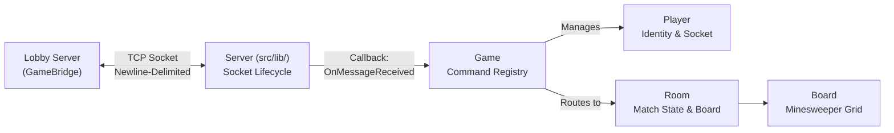

# Campo Minado Architecture 

The **Campo Minado** server is structured to cleanly separate low-level POSIX socket communication (`src/lib/`) from high-level game rules (`Board`, `Room`) and network action routing (`Game`).

---

## 1. Architectural Overview



### Module Responsibilities

| Component | Files | Responsibility |
| :--- | :--- | :--- |
| **Transport (`Server`)** | `src/lib/server.hpp / .cpp` | Manages the TCP connection with the Lobby Server, frames incoming newline-delimited (`\n`) messages, and shields against `SIGPIPE`. |
| **Command Router (`Game`)** | `src/game.hpp / .cpp`<br/>`src/game_actions.cpp`<br/>`src/game_connection.cpp` | Registers command handlers (`_commands`), tracks connected `Player`s and active `Room`s, handles network validations, and broadcasts results. |
| **Match State (`Room`)** | `src/room.hpp / .cpp` | Represents an individual difficulty room (ID 1-3). Stores the match timer, accumulated penalties, the current `RoomState` (LOBBY, PLAYING, NAMING), and the `Board`. |
| **Game Engine (`Board`)** | `src/board.hpp / .cpp` | Implements the Minesweeper logic: coordinate parsing, mine generation (with first-click safety), flood-fill algorithms, and rendering the ASCII grid with ANSI colors. |
| **Data Storage (`Leaderboard`)**| `src/leaderboard.hpp / .cpp` | Parses and writes to `stats_{easy,medium,hard}.txt`. Formats the top-5 times for the `!rank` command. |

---

## 2. Command Dispatch Mechanism

Every message forwarded by the Lobby Server follows a 3-token prefix:

```text
<ClientID> <MsgID> <Command> [Arguments...]
```

When `Game::ProcessMessage` receives a line:
1. It extracts `client_id`, `msg_id`, and `command`.
2. It looks up `command` in the `_commands` registry.
3. If found, it invokes the handler (`HandleJoinRoom`, `HandlePlayerAction`, etc.) in `game_actions.cpp`.
4. The handler performs a flat, $O(N)$ lookup using `FindPlayer()` and `FindRoom()` to execute the logic, returning a `Response <MsgID> Success/Fail` line to the Lobby.

---

## 3. Play Lifecycle

1. **`JoinRoom <RoomID>`**: 
   The player is assigned to `RoomID`. If the room is in `LOBBY` state, they see the `@SCREEN_TAG` header with `[ STATUS: LOBBY ]` and the blank board.
2. **`StartGame`**: 
   Sent by the host (`ClientID 0`) or `!start`. The room enters `PLAYING`.
3. **`PlayerAction <Move>`**: 
   The player sends a move like `B3` or `f C4`. The string is parsed, indices are converted to X/Y coordinates, and `Board::Reveal` or `Board::SetFlag` is executed.
   - If a mine is hit, `Room::AddPenalty` applies the time penalty.
   - If the board is complete, `Room::SetWon` stops the timer and enters `NAMING`.
4. **`NameTeam <TeamName>`**:
   Sent by the host. Saves the team's final time to the stats file via `Leaderboard::SaveTeamScore`. Resets the room back to `LOBBY`.

---

## 4. Player Names & Leaderboard

### 4.1. Name Synchronization
Players pick a nickname in the Lobby with `nick <Name>`. The Lobby delivers it to the game via:
* `ConnectClient internal_init <ClientID> <LobbyRoomID> <Nickname>`
* `SetPlayerName internal_name <ClientID> <Nickname>`

The `Game` stores this in `Player::_name`, ensuring the live screen headers and logs immediately reflect the correct names.

### 4.2. Leaderboard Storage
Files live in the game process's working directory (`stats_easy.txt`, etc.). Each winning team writes **one line per player**:
```text
<PlayerName> <TotalSeconds> <PlayerCount> <TeamName>
```
The `!rank` command calls `Leaderboard::GetRankingString`, keeping each player's **best** time and sorting ascending.
