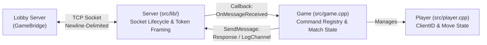

# Game Template Architecture 

The **Game Server Template** is structured to cleanly separate low-level POSIX socket communication (`src/lib/`) from high-level game rules and state management (`src/`).

> [!NOTE]
> Sections 1–4 still describe the original "Higher or Lower" template this game was forked from. Minesweeper-specific behavior that has been documented so far lives in [Section 5](#5-minesweeper-player-names--leaderboard).

---

## 1. Architectural Overview



### Module Responsibilities

| Component | Files | Responsibility |
| :--- | :--- | :--- |
| **Transport Library (`Server`)** | `src/lib/server.hpp`<br/>`src/lib/server.cpp` | Manages the TCP connection with the Lobby Server, frames incoming newline-delimited (`\n`) messages, provides thread-safe `SendMessage()`, and dispatches inbound lines to the `Game` layer. |
| **Game Controller (`Game`)** | `src/game.hpp`<br/>`src/game.cpp` | Maintains active player records, registers command handlers in `_commands`, validates player moves and administrative actions, evaluates round winners, and formats `Response` and `LogChannel` packets. |
| **Player Entity (`Player`)** | `src/player.hpp`<br/>`src/player.cpp` | Stores per-player match data (`_id`, chosen `_number`, and `_has_played` round flag). |
| **Configuration (`config.hpp`)** | `src/config.hpp` | Defines compile-time game constants such as `REQUIRED_PLAYERS` (default: `2`). |
| **Entry Point (`main.cpp`)** | `src/main.cpp` | Parses the CLI port argument, ignores `SIGPIPE`, instantiates `Server` and `Game`, and starts the server loop. |

---

## 2. Networking Layer (`src/lib/Server`)

The `Server` class handles the two connection topologies supported by the Lobby Server's `GameBridge`:

1. **Stream Framing (`ReadToken`):**
   Reads raw bytes from the Lobby socket into a persistent buffer, extracting complete lines terminated by `\n` (and stripping trailing `\r`). If the peer closes the connection (`read() == 0`) or exceeds the maximum buffer threshold, the server loop terminates cleanly.
2. **Reliable Outbound Transmission (`SendMessage`):**
   Executes a loop over `send(..., MSG_NOSIGNAL)` until the entire string payload is transmitted, retrying automatically on `EINTR`.

---

## 3. Command Dispatch Mechanism (`Game::_commands`)

Every message forwarded by the Lobby Server to the Game Server follows the canonical 3-token prefix defined in `GAME_INTEGRATION.md`:

```text
<ClientID> <MsgID> <Command> [Arguments...]
```

When `Game::ProcessMessage(int socket_fd, const std::string& message)` receives a line:
1. It extracts `client_id` (`int`), `msg_id` (`std::string`), and `command` (`std::string`) using `std::istringstream`.
2. It performs an $O(1)$ lookup in `_commands` (`std::unordered_map<std::string, CommandHandler>`).
3. If found, it invokes the registered handler with `(socket_fd, client_id, msg_id, iss)`.
4. If the command is unrecognized, it replies with:
   ```text
   Response <MsgID> Fail "Unknown game command"
   ```

---

## 4. Implemented Commands & State Machine ("Higher or Lower")

The template implements a turn-independent simultaneous round game for `REQUIRED_PLAYERS` (2 players):

### 4.1. `PlayerAction <Number>`
* **Origin:** Sent by a player (`<ClientID> > 0`).
* **Validation:**
  1. Verifies that the argument is a valid integer (`Number`).
  2. Checks if the player has already submitted a number in the current round (`player->hasPlayed()`). If so, replies `Response <MsgID> Fail "You have already played in this round"`.
  3. Checks if the round is already full (`active_players.size() >= REQUIRED_PLAYERS`).
* **Execution:**
  * Records the player's number and marks `_has_played = true`.
  * Replies `Response <MsgID> Success`.
  * Sends a private confirmation to the player: `LogChannel <ClientID> "You chose number <Number>"`.
* **Round Resolution:**
  * Once `REQUIRED_PLAYERS` have played, the game compares their numbers, broadcasts both choices and the winner via `LogChannel All "..."`, and resets all players' `_has_played` flags for the next round.

### 4.2. `ServerAction <SubCommand> [Args...]`
* **Origin:** Sent exclusively by the Room Creator (Host), validated by the Lobby Server and forwarded with `<ClientID> = 0`.
* **Validation:** Rejects any `ServerAction` where `client_id != 0`.
* **Supported Sub-Commands:**
  * `ResetRound`: Clears the moves of all players in the current round (`ResetAllPlayers()`), replies `Response <MsgID> Success`, and broadcasts `LogChannel All "Round reset by the room creator!"`.

### 4.3. `PlayerDisconnected <TargetClientID>`
* **Origin:** Sent automatically by the Lobby Server (`0 0 PlayerDisconnected <TargetClientID>`) when a player leaves the room or drops their TCP connection.
* **Execution:** Removes `<TargetClientID>` from the `_players` map so the remaining players are not blocked waiting for a disconnected participant, and broadcasts the disconnection via `LogChannel All`. Note that no `Response` packet is sent because `<MsgID>` is `0`.


---

## 5. Minesweeper: Player Names & Leaderboard

### 5.1. Where names come from
Players pick a nickname in the Lobby with `SetNick` (client shortcut: `nick <Name>`). The Lobby validates it (1–16 chars of `[A-Za-z0-9_.-]`, unique among connected clients) and delivers it to the game in one of two ways:

| Situation | Message received by the game | Handler |
| :--- | :--- | :--- |
| Name set before the player is registered (before `sg`, or before joining) | `ConnectClient internal_init <ClientID> <LobbyRoomID> <Nickname>` | `Game::HandleConnectClient` (`src/game_connection.cpp`) |
| Name set/changed while already registered in the running match | `SetPlayerName internal_name <ClientID> <Nickname>` | `Game::HandleSetPlayerName` (`src/game_connection.cpp`) |

Players that never set a nickname keep the default `Player <ClientID>` assigned in the `Player` constructor.

### 5.2. Where names are used
* **`Player::_name`** (`src/player.hpp`): stores the display name. `setName("")` is a no-op, so a missing token never erases a name.
* **Screen header**: `Game::GetRoomPlayersString()` builds `[ Jogadores na sala: Alex_W, Pintudo ]` from `getName()`.
* **Logs**: join/return messages (`"<name> entrou no servidor."`, `"<name> voltou."`), live renames (`"<old> agora é <new>."`, followed by a header refresh), and the "only the leader can name the team" error.

### 5.3. Leaderboard storage (`stats_easy.txt`, `stats_medium.txt`, `stats_hard.txt`)
Files live in the game process's working directory and are append-only, so they survive server restarts. Each winning team writes **one line per player**:

```text
<PlayerName> <TotalSeconds> <PlayerCount> <TeamName>
```

* Names are stored as a single whitespace-free token. The default `Player 123` is written as `Player_123`.
* `!rank <easy|medium|hard>` (`Ranking`) keeps each player's **best** time, sorts ascending, and prints `rank | player | mm:ss | team | N jog.`.
* **Backward compatibility:** older files stored bare numeric client IDs (`482910 107 2 pintudos`). Those lines still parse and are shown as `Player 482910`.

> [!NOTE]
> The leaderboard is keyed by name, so the same nickname across sessions accumulates into one entry. Client IDs are random for each connection, which is why they were replaced as the key.