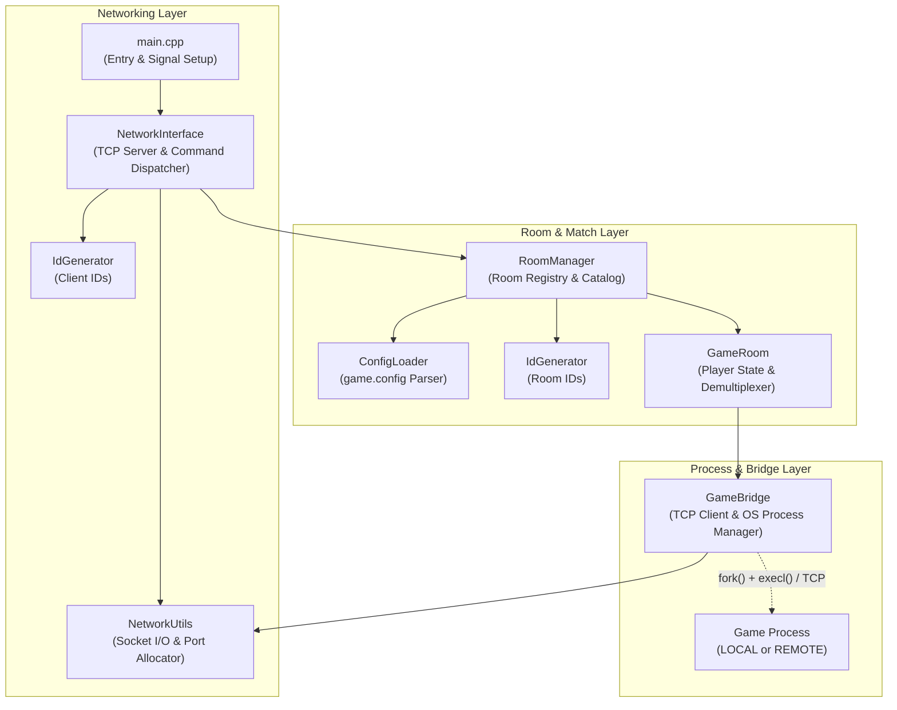
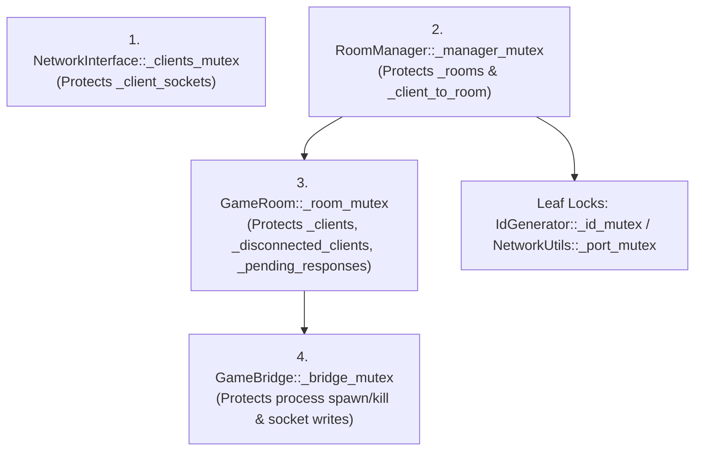

# Lobby Server — Architecture & Maintenance Guide

This document describes the internal architecture, threading model, synchronization hierarchy, and resource lifecycle of the **Lobby** server. It is intended for developers maintaining or extending the core C++ codebase.

---

## 1. Architectural Overview

The Lobby server is a multi-threaded TCP reverse proxy and room orchestrator. Its primary design goal is to decouple **connection, authentication, and room management** from **game logic**.

### Core Design Principles
1. **Language-Agnostic Game Execution:** Games run as independent OS processes (`LOCAL`) or external servers (`REMOTE`) and communicate with the Lobby over a newline-delimited (`\n`) TCP stream via `GameBridge`.
2. **Zero-Trust Client Identification:** Clients never transmit their own `ClientID` in command payloads. `NetworkInterface` binds a generated `ClientID` directly to the authenticated TCP socket thread and injects it server-side.
3. **Fault Isolation:** A crash, hang, or malformed output in a game process only affects its owning `GameRoom`, never the Lobby server or other active rooms.

### High-Level Component Diagram



---

## 2. Module Breakdown

| Module | Files | Responsibility |
| :--- | :--- | :--- |
| **Entry Point** | `main.cpp` | Parses CLI arguments (`<LOBBY_PORT> [CONFIG_FILE]`), ignores `SIGPIPE` (`SIG_IGN`), and boots `NetworkInterface`. |
| **Network Interface** | `network_interface.hpp`<br/>`network_interface.cpp` | Owns the main listening socket, accepts incoming client connections, spawns per-client worker threads, and dispatches commands via `_command_registry` or forwards in-game commands to the client's active `GameRoom`. |
| **Room Manager** | `room_manager.hpp`<br/>`room_manager.cpp` | Loads the game catalog (`_available_games`), maintains the active rooms map (`_rooms`) and the fast lookup index (`_client_to_room`), and handles room creation, joining, host migration, and empty room cleanup. |
| **Game Room** | `game_room.hpp`<br/>`game_room.cpp` | Manages the players inside a single room (`_clients`), tracks disconnected match players (`_disconnected_clients`), prefixes `<MsgID>` tokens to prevent inter-client collisions (`_pending_responses`), and runs the `ListenToGame` demultiplexer thread. |
| **Game Bridge** | `game_bridge.hpp`<br/>`game_bridge.cpp` | Abstracts the connection to the game server. In `LOCAL` mode, manages `fork()`, file descriptor cleanup, `execl()`, readiness polling, and graceful/forced termination (`SIGTERM` $\rightarrow$ `SIGKILL`). |
| **Network Utils** | `network_utils.hpp`<br/>`network_utils.cpp` | Stateless POSIX socket wrappers (`SendMessage` with partial-write loop and `MSG_NOSIGNAL`; `ReadToken` with `\r\n` stripping and 8 KB buffer cap) plus thread-safe local port allocation (`[10000, 65534]`). |
| **ID Generator** | `id_generator.hpp`<br/>`id_generator.cpp` | Thread-safe unique ID allocator in `[1000, 999999]`. Uses a hybrid algorithm: 100 random `std::mt19937` probes followed by a deterministic circular linear scan. |
| **Game Config** | `game_config.hpp`<br/>`game_config.cpp` | Parses `game.config` into `GameConfig` structs (`LOCAL` executable path vs. `REMOTE` IP and port). |

---

## 3. Threading & Concurrency Model

The Lobby uses a **thread-per-connection** model combined with fine-grained mutex locking and lock-free atomics for high-frequency state checks.

### 3.1. Active Threads

1. **Main Accept Thread (`NetworkInterface::Start`):**
   * Runs the `accept()` loop on `_server_fd`.
   * Acquires a `ClientID`, registers the socket in `_client_sockets`, sends the welcome `LogChannel 0` event, and spawns a detached client thread.
2. **Client Worker Threads (`NetworkInterface::HandleClient` — 1 per client):**
   * Continuously reads newline-delimited commands via `NetworkUtils::ReadToken`.
   * Executes Lobby commands or forwards game commands through `GameRoom::ForwardCommandToGame`.
   * On EOF or buffer overflow, cleans up `_client_sockets`, removes the client from their room (`_room_manager.RemoveClientFromRoom`), releases the `ClientID`, and closes the socket.
3. **Game Listener Threads (`GameRoom::ListenToGame` — 1 per active match):**
   * Spawned when `GameRoom::StartGame` succeeds.
   * Holds a `std::shared_ptr<GameRoom>` via `shared_from_this()` to guarantee the `GameRoom` instance stays alive until the thread exits.
   * Continuously reads lines from `GameBridge::ReadNextToken`, demultiplexing `Response` (unicast) and `LogChannel` (broadcast or targeted `IdList`) back to room clients.

---

### 3.2. Synchronization & Lock Hierarchy

To prevent deadlocks, locks must **always** be acquired from top to bottom according to the hierarchy below. A lower-level component must never call back into a higher-level component while holding a lock.



#### Critical Concurrency Invariants
* **Non-Blocking Room Queries:** `GameRoom::_creator_id` (`std::atomic<int>`) and `GameRoom::_player_count` (`std::atomic<size_t>`) are atomic. This allows `RoomManager::FormatRoomsList()` to iterate over `_rooms` under `_manager_mutex` without acquiring each room's `_room_mutex`.
* **Lock-Free Startup Polling (`_is_starting`):** When `GameBridges::Connect` spawns a `LOCAL` game, it polls `connect()` for up to 1 second (20 attempts $\times$ 50ms). `GameRoom::StartGame` uses `std::atomic<bool> _is_starting` (`compare_exchange_strong`) and executes `_bridge.Connect()` **outside** `_room_mutex` so other room operations and `ListRooms` are never blocked during game startup.
* **Concurrent Socket Read/Write in `GameBridge`:** `GameBridge::ReadNextToken` (called by the `ListenToGame` thread) reads `_game_fd` (`std::atomic<int>`) without locking `_bridge_mutex`, because a blocking `read()` under `_bridge_mutex` would deadlock `GameBridge::Send` and `GameBridge::Disconnect`. Full-duplex TCP sockets safely support one concurrent reader thread and one mutex-serialized writer (`GameBridge::Send`).

---

## 4. Process, Signal & Resource Lifecycle

### 4.1. `LOCAL` Child Process Isolation (`GameBridge::SpawnLocalProcess`)
When `fork()` creates the child process for a `LOCAL` game:
1. The child closes all file descriptors from `3` to `1023`. This prevents the game process from inheriting the Lobby's listening socket (`_server_fd`) or any connected client sockets, which would otherwise keep ports bound if the Lobby restarts or cause hanging connections when clients disconnect.
2. Standard I/O (`stdin = 0`, `stdout = 1`, `stderr = 2`) remains attached so game logs appear in the Lobby console.
3. `execl()` replaces the child process image with the game binary, passing the allocated port as `argv[1]`. If `execl()` fails, `_exit(1)` is called immediately (avoiding flushing parent I/O buffers or invoking parent static destructors).

### 4.2. Two-Stage Process Termination (`GameBridge::StopLocalProcess`)
When a match ends (`StopGame`), the room empties, or the game closes its TCP connection:
1. `GameBridge::Disconnect` atomically swaps `_game_fd` with `-1` and calls `shutdown(fd, SHUT_RDWR)` followed by `close(fd)` to immediately wake up any blocked `read()` in `ListenToGame`.
2. `StopLocalProcess` sends `SIGTERM` to `_game_pid` and polls `waitpid(_game_pid, &status, WNOHANG)` up to 10 times (20ms intervals = 200ms total).
3. If the child process is stuck in an infinite loop or ignores `SIGTERM`, the Lobby escalates to `SIGKILL` and performs a final `waitpid` to reap the zombie process.

### 4.3. `SIGPIPE` Immunity
Writing to a TCP socket whose peer has already closed the connection triggers `SIGPIPE` from the OS kernel. The Lobby prevents server termination in two ways:
* Globally ignoring the signal in `main.cpp` via `std::signal(SIGPIPE, SIG_IGN)`.
* Passing the `MSG_NOSIGNAL` flag to `send()` in `NetworkUtils::SendMessage`.

---

## 5. Internal Message Routing & Demultiplexing

### 5.1. Collision-Free `<MsgID>` Translation
Because two clients in the same room can independently send commands with the same `<MsgID>` (e.g., `PlayerAction m1 10`), `GameRoom` rewrites the message ID before sending it to the game:

```text
Client (ID 1050) -> Lobby:   PlayerAction m1 10
Lobby -> GameBridge:         PlayerAction 1050_m1 1050 10
GameBridge -> Lobby:         Response 1050_m1 Success
Lobby -> Client (ID 1050):   Response m1 Success
```

* `_pending_responses` maps `"1050_m1"` $\rightarrow$ `PendingRequest{ sender_id: 1050, original_msg_id: "m1" }`.
* Even when the room creator uses `ServerAction` (where `effective_id` becomes `0`), `sender_id` remains the creator's real `ClientID`, ensuring the response is routed back to the creator's socket.

### 5.2. Player Reconnection State Machine (`_disconnected_clients`)
Within a single active match (`_bridge.IsActive() == true`):
* **First join (`AddClient`):** Not in `_disconnected_clients` $\rightarrow$ sends `ConnectClient internal_init <ClientID> <RoomID>`.
* **Leave / Kick / Socket drop (`RemoveClient`):** Inserted into `_disconnected_clients` $\rightarrow$ sends `DisconnectClient internal_disc <ClientID>`.
* **Re-join during the same match (`AddClient`):** Found and erased from `_disconnected_clients` $\rightarrow$ sends `ReconnectClient internal_recon <ClientID>`.
* **Match ends (`DisconnectGame` / `StartGame`):** `_disconnected_clients` and `_pending_responses` are cleared.

---

## 6. Maintenance Guide: How to Extend the Lobby

### Adding a New Lobby Command
To add a new native command (for example, `RoomInfo <MsgID>`):

1. **Declare the Handler in `network_interface.hpp`:**
   ```cpp
   /// @brief Returns detailed metadata about the client's current room.
   /// @param ctx The context containing client information and message data.
   void HandleRoomInfo(CommandContext& ctx);
   ```
2. **Register the Command in `NetworkInterface::RegisterCommands()` (`network_interface.cpp`):**
   ```cpp
   _command_registry["RoomInfo"] = [this](CommandContext& ctx) { HandleRoomInfo(ctx); };
   ```
3. **Implement the Handler in `network_interface.cpp`:**
   * Parse any required parameters from `ctx.iss`.
   * Query `_room_manager` or `GameRoom` (respecting the lock hierarchy in Section 3.2).
   * Send a reply formatted as `"Response " + ctx.msg_id + " Success ...\n"` or `"Response " + ctx.msg_id + " Fail \"...\"\n"` via `NetworkUtils::SendMessage(ctx.socket_fd, ...)`.
4. **Update Documentation:**
   * Document the syntax, response format, and failure cases in `CLIENT_PROTOCOL.md`.