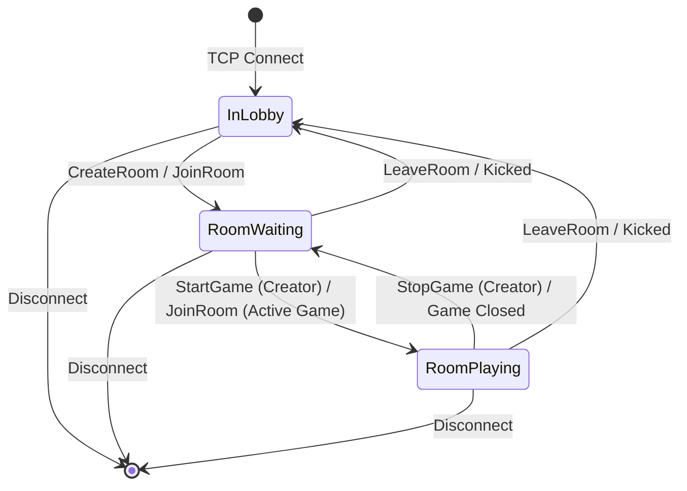

# Client Protocol Manual

This document specifies the communication protocol between a **Client** application (or terminal tools such as `nc` / `telnet`) and the **Lobby** server.

All communication occurs over a persistent **TCP connection** using plain text lines terminated by a newline character (`\n` or `\r\n`). Empty lines are ignored, and any single line exceeding **8192 bytes** without a newline will cause the server to drop the connection immediately.

---

## 1. Connection Lifecycle & Client States

When a client connects to the Lobby TCP port, the server automatically generates a unique `ClientID` in the range `[1000, 999999]` and sends a welcome message:

```text
LogChannel 0 "Connected with ClientID 482910"
```

> **If the server is at full capacity:** The Lobby sends `LogChannel 0 "Server is full. Try again later."` and closes the socket immediately.

### Client State Machine

A connected client transitions between three logical scopes:



---

## 2. Message Framing

### 2.1. Client $\rightarrow$ Server (Requests)

Every command sent by the client must follow the structure below:

```text
<Command> <MsgID> [Parameters...]\n
```

* **`<Command>`**: The action to execute (case-sensitive).
* **`<MsgID>`**: An arbitrary token chosen by the client (e.g., `m1`, `req_42`) used to correlate asynchronous responses with their original requests. Each client has its own isolated `<MsgID>` namespace, so multiple players in the same room can safely use identical IDs (such as `m1`) simultaneously without collision.
* **`[Parameters...]`**: Space-separated arguments required by the command.

> **Important Security Note:** Clients **never** send their own `ClientID` in the message payload. The Lobby identifies the sender directly from the authenticated TCP socket.

### 2.2. Server $\rightarrow$ Client (Responses & Events)

The client can receive two types of messages from the server at any time:

| Prefix | Type | Format | Description |
| :--- | :--- | :--- | :--- |
| **`Response`** | Unicast Reply | `Response <MsgID> <Success\|Fail> [Data_or_Reason]\n` | Direct answer to a command previously sent by this client with `<MsgID>`. |
| **`LogChannel`** | Asynchronous Event | `LogChannel <Channel> <Message>\n` | Push notification from the Lobby (`Channel = 0`), room-wide game broadcast (`Channel = All`), or private/targeted game event (`Channel = <ClientID>` or `<IdList>`). |

#### `LogChannel` Target Channels
* **`0`**: System and room lifecycle events generated by the Lobby (e.g., player joined/left, host migration, game started/stopped).
* **`All`**: Public match events broadcast by the running Game to everyone in the room.
* **`<IdList>`** (e.g., `482910`, `482910,739104`, or `[482910,739104]`): Private or team-specific game messages routed exclusively to the listed client IDs.

---

## 3. Lobby Commands Reference

### 3.1. Discovery Commands

#### `ListGames`
Lists all games configured in the server's `game.config` catalog.
* **Syntax:** `ListGames <MsgID>`
* **Example Request:**
  ```text
  ListGames m1
  ```
* **Success Response:**
  ```text
  Response m1 Success | HigherLower[Local] | Battleship[Remote]
  ```
  *(If no games are configured: `Response m1 Success "No games configured"`)*

#### `ListRooms`
Lists all active rooms currently open in the Lobby.
* **Syntax:** `ListRooms <MsgID>`
* **Example Request:**
  ```text
  ListRooms m2
  ```
* **Success Response:**
  ```text
  Response m2 Success | ID:504123 Name:Arena1 Game:HigherLower Players:2 [Public][Waiting]
  ```
  *(If no rooms exist: `Response m2 Success "No rooms available"`)*

---

### 3.1.1. Identity Commands

#### `SetNick`
Sets the client's display nickname. Clients without a nickname appear as `Player <ClientID>` inside games.
* **Scope:** Available anywhere — in the Lobby, in a waiting room, or during a running match.
* **Syntax:** `SetNick <MsgID> <Nickname>`
* **Rules:**
  * 1–16 characters, only `A–Z`, `a–z`, `0–9`, `_`, `-` and `.` (nicknames travel inside space-separated protocol lines and quoted `LogChannel` payloads).
  * Must be unique among currently connected clients.
  * Only the first token is used: `SetNick m5 cool name` sets the nickname to `cool`.
  * Released automatically when the client disconnects.
* **Example Request:**
  ```text
  SetNick m5 Alex_W
  ```
* **Success Response + private confirmation:**
  ```text
  Response m5 Success
  LogChannel 0 "Nickname set to Alex_W"
  ```
* **Propagation:**
  * Set **before** creating/joining a room → the nickname is attached to the `ConnectClient` registration sent to the game.
  * Set **while in a room with a running match** → the Lobby forwards `SetPlayerName` to the game immediately (see `GAME_INTEGRATION.md` §3.1).
* **Possible Failures:**
  * `"Usage: SetNick <MsgID> <Nickname>"`
  * `"Nickname must be 1-16 chars of letters, digits, '_', '-' or '.'"`
  * `"Nickname already in use"`

---

### 3.2. Room Management Commands

#### `CreateRoom`
Creates a new room for a configured game and automatically places the creator inside it.
* **Syntax:** `CreateRoom <MsgID> <RoomName> <GameName> [Password]`
* **Example Request (Public Room):**
  ```text
  CreateRoom m3 Arena1 HigherLower
  ```
* **Example Request (Private Room):**
  ```text
  CreateRoom m3 SecretArena HigherLower mypass123
  ```
* **Success Response (returns the generated `RoomID`):**
  ```text
  Response m3 Success 504123
  ```
* **Possible Failures:**
  * `"Client already in a room"`
  * `"Usage: CreateRoom <MsgID> <RoomName> <GameName> [Password]"`
  * `"Game not found in game.config"`
  * `"Maximum number of rooms reached"`

#### `JoinRoom`
Joins an existing room by its `RoomID`.
* **Active Match Behavior (`[Playing]`):**
  * If the player is joining this match for the first time, the Lobby registers them in the running game via `ConnectClient`.
  * If the player was previously in this match and left, was kicked, or re-entered with the same `ClientID`, the Lobby automatically restores their session in the running game via `ReconnectClient`.
* **Syntax:** `JoinRoom <MsgID> <RoomID> [Password]`
* **Example Request:**
  ```text
  JoinRoom m4 504123 mypass123
  ```
* **Success Response:**
  ```text
  Response m4 Success
  ```
* **Room Broadcast:** All room members receive:
  ```text
  LogChannel 0 "ClientID 482910 joined the room"
  ```
* **Possible Failures:**
  * `"Client already in a room"`
  * `"Room ID required"`
  * `"Room not found"`
  * `"Incorrect password"`

#### `LeaveRoom`
Removes the client from their current room and returns them to the Lobby scope.
* **Syntax:** `LeaveRoom <MsgID>`
* **Example Request:**
  ```text
  LeaveRoom m5
  ```
* **Success Response:**
  ```text
  Response m5 Success
  ```
* **Side Effects (Game Notification, Host Migration & Cleanup):**
  * If a match is currently running (`[Playing]`), the Lobby automatically notifies the game process via `DisconnectClient`.
  * If the room becomes empty (`0` players), any active game connection is closed (terminating the local process if `LOCAL`) and the room is deleted automatically.
  * If the room creator leaves while other players remain, ownership is automatically transferred to the next player in the room:
    ```text
    LogChannel 0 "ClientID 482910 left the room"
    LogChannel 0 "ClientID 739104 is now the room creator"
    ```
* **Possible Failures:**
  * `"Client is not in a room"`

---

### 3.3. Room Creator (Host) Commands

The following commands can **only** be executed by the current creator of the room (`_creator_id`).

#### `StartGame`
Spawns the local game binary (if `LOCAL`) or connects to the external game server (if `REMOTE`), registering all players currently in the room.
* **Syntax:** `StartGame <MsgID>`
* **Example Request:**
  ```text
  StartGame m6
  ```
* **Success Response & Broadcast:**
  ```text
  Response m6 Success
  LogChannel 0 "Game HigherLower started in room Arena1"
  ```
* **Possible Failures:**
  * `"Client is not in a room"`
  * `"Only the room creator can start the game"`
  * `"Game is already running"`
  * `"Game configuration missing"`
  * `"No available local ports to start the game"`
  * `"Failed to start or connect to game"`

#### `StopGame`
Forcibly terminates the running match and returns the room status to `[Waiting]` while keeping all players inside the room.
* **Syntax:** `StopGame <MsgID>`
* **Example Request:**
  ```text
  StopGame m7
  ```
* **Success Response & Broadcast:**
  ```text
  Response m7 Success
  LogChannel 0 "Game forcibly stopped by the room creator"
  ```
* **Possible Failures:**
  * `"Client is not in a room"`
  * `"Only the room creator can stop the game"`
  * `"No game is currently running"`

#### `ServerAction`
Allows the room creator to send an administrative command to the running Game process authenticated as **Client `0`**.
* **Syntax:** `ServerAction <MsgID> <GameCommand> [GameParams...]`
* **Example Request:**
  ```text
  ServerAction m8 ResetRound 60
  ```
* **Behavior:** The Lobby forwards `ResetRound <CreatorID>_m8 0 60` to the Game process, strips the internal prefix when the Game replies, and routes `Response m8 ...` back to the room creator.
* **Possible Failures:**
  * `"Client is not in a room"`
  * `"Only the room creator can execute actions as Client 0"`
  * `"Game has not started yet"`
  * `"Usage: ServerAction <MsgID> <GameCommand> [Params...]"`

#### `KickPlayer`
Removes a target player from the room and returns them to the Lobby. If a match is running, the game process is automatically notified via `DisconnectClient`.
* **Syntax:** `KickPlayer <MsgID> <TargetClientID>`
* **Example Request:**
  ```text
  KickPlayer m9 739104
  ```
* **Success Response & Notifications:**
  * To the creator: `Response m9 Success`
  * To the kicked player: `LogChannel 0 "You have been kicked from room Arena1"`
  * To the remaining room members: `LogChannel 0 "ClientID 739104 left the room"`
* **Possible Failures:**
  * `"Client is not in a room"`
  * `"Only the room creator can kick players"`
  * `"Usage: KickPlayer <MsgID> <TargetClientID>"`
  * `"Cannot kick yourself, use LeaveRoom instead"`
  * `"Target player is not in this room"`

---

## 4. In-Game Commands (Passthrough Routing)

While a client is inside a room whose status is `[Playing]`, any command **not** listed in Section 3 is treated as a game command and forwarded automatically to the Game process.

* **Client Request:**
  ```text
  PlayerAction m10 500
  ```
* **Behavior:**
  1. If the client is **not** in a room: returns `Response m10 Fail "Unknown Lobby Command"`.
  2. If the room is still `[Waiting]`: returns `Response m10 Fail "Game has not started yet"`.
  3. If the room is `[Playing]`: forwards `PlayerAction <ClientID>_m10 <ClientID> 500` to the Game, strips the `<ClientID>_` prefix when the reply arrives, and routes `Response m10 ...` back to the client.