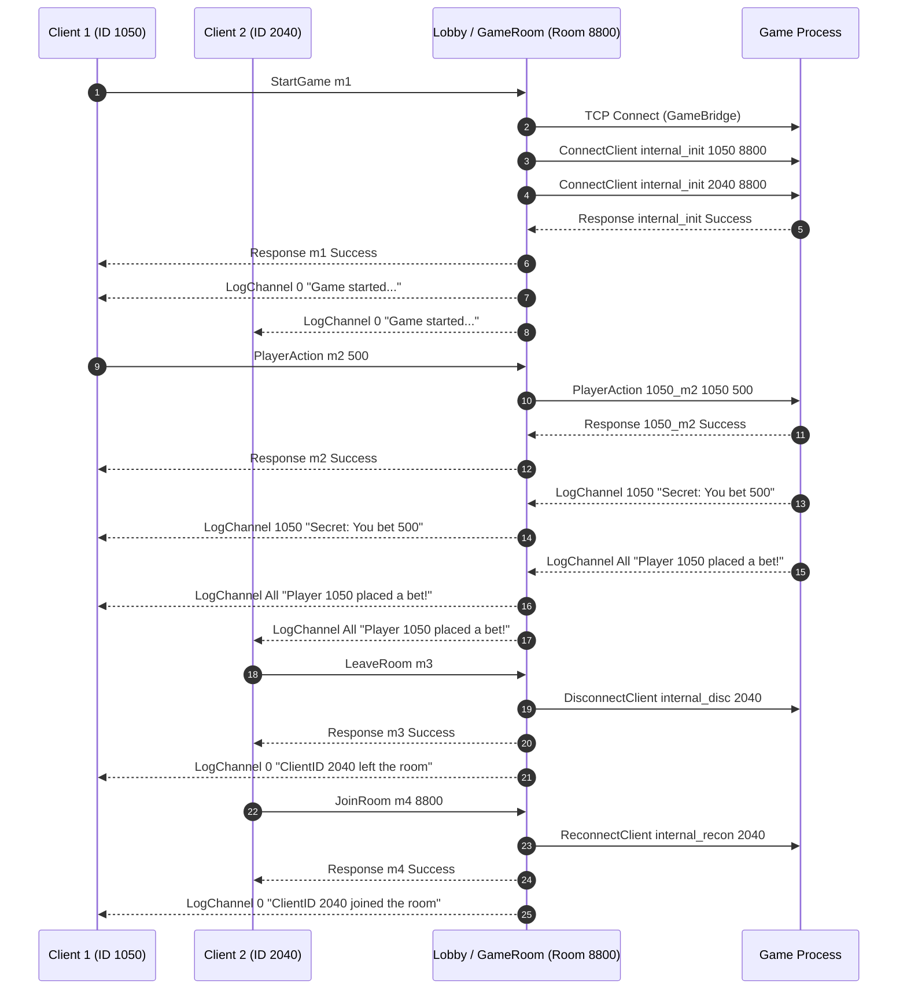

# Game Integration Manual

This document describes how to configure, develop, and integrate new games into the **Lobby** server.

The Lobby acts as a reverse TCP proxy (`GameBridge`): it manages client connections, ID authentication, passwords, and rooms, forwarding only validated commands to the game executable through a simple newline-delimited (`\n`) text protocol. This allows games to be written in **any programming language** (C++, Python, Rust, Go, Node.js), provided they implement a TCP server compatible with the rules below.

---

## 1. Catalog Registration (`game.config`)

To make a game available in the Lobby, add an entry to the `game.config` file in the server root directory. The system supports two execution modes:

```ini
# LOCAL Format:  
# <GameName>    LOCAL            <ExecutablePath>
HigherLower     LOCAL      ../game/build/template/game

# REMOTE Format:
# <GameName>       REMOTE    <IPAddress>   <Port>
HigherLowerExt     REMOTE     127.0.0.1     8081
Battleship         REMOTE   192.168.1.100   8085
```

### Mode Comparison

| Feature | `LOCAL` Mode | `REMOTE` Mode |
| :--- | :--- | :--- |
| **Initialization** | The Lobby automatically spawns a child process when the room creator executes `StartGame`. | The game developer runs and maintains the server independently on another port or machine. |
| **Port Allocation** | The Lobby automatically finds a free TCP port and passes it to the process. | The port is fixed and must be specified in the 4th column of `game.config`. |
| **Room Isolation** | Each room gets its own dedicated OS game process. | Multiple Lobby rooms can connect simultaneously to the same external server. |
| **Termination** | When the match stops (`StopGame`) or the room becomes empty, the Lobby closes the socket and terminates the process (`SIGTERM`, escalating to `SIGKILL` after 200ms if unresponsive). | The Lobby only closes the TCP connection for that room, the external server keeps running. |

---

## 2. Lifecycle and TCP Connection

### Requirements for `LOCAL` Games
1. **Command-Line Argument:** The executable must accept the TCP port as its first argument (`./your_game <PORT>`).
2. **Startup Readiness Window:** After spawning the child process, `GameBridge` attempts to connect for up to **1 second** (20 attempts at 50ms intervals). The game must `bind()` and `listen()` on the designated port within this window.
3. **Standard I/O and Console Logging:** The Lobby isolates its internal network sockets before launching the game process, but keeps standard output (`stdout` and `stderr`) attached to the parent console. Any logs printed by a `LOCAL` game will appear directly in the Lobby terminal.

### Requirements for `REMOTE` Games
* Each active Lobby room that starts a match will open **a new TCP connection** to the game server.
* The remote server can isolate matches in two ways:
  1. **By Socket (`socket_fd`):** Treating each TCP connection accepted via `accept()` as an independent room instance.
  2. **By `RoomID` or `ClientID`:** Using the room identifier sent by the Lobby in the `ConnectClient` command.

---

## 3. Inbound Protocol (Lobby $\rightarrow$ Game)

All messages sent from the Lobby to the Game end with `\n` (with any trailing `\r` already stripped by the Lobby) and follow this structure:

```text
<Command> <MsgID> <EffectiveClientID> [Parameters...]\n
```

> **Security Guarantee (Anti-Spoofing):** Players never send their own IDs to the Lobby. The `<EffectiveClientID>` field is injected directly by the `GameRoom` based on the client's authenticated connection.

> **Collision-Free `<MsgID>`:** Because multiple clients in the same room may send commands using identical message IDs (e.g., `m1`), `GameRoom` automatically prefixes player-originated message IDs with the sender's client ID (`<SenderID>_<ClientMsgID>`) before forwarding to the game. Your game server does **not** need to parse this prefix — simply echo the exact `<MsgID>` token back in your `Response`, and the Lobby will restore the original ID for the client.

### 3.1. Automatic Player Lifecycle (`ConnectClient`, `DisconnectClient`, `ReconnectClient`)

`GameRoom` automatically notifies the game process whenever players join, leave, or return to a room with an active match:

#### 1. Initial Registration (`ConnectClient`)
Sent for every player in the room as soon as the TCP connection to the game is established, and whenever a new player joins the room for the first time during an active match:

```text
ConnectClient internal_init <ClientID> <RoomID>\n
```

* **`<ClientID>`**: Unique player ID randomly generated by the Lobby (range `[1000, 999999]`).
* **`<RoomID>`**: Unique room ID in the Lobby (range `[1000, 999999]`). `LOCAL` games may ignore this 4th parameter if desired, as each process serves a single room.

#### 2. Player Departure (`DisconnectClient`)
Sent automatically if a registered player leaves the room (`LeaveRoom`), is kicked (`KickPlayer`), or loses their TCP connection while the match is running:

```text
DisconnectClient internal_disc <ClientID>\n
```

#### 3. Player Return (`ReconnectClient`)
Sent automatically if a player who previously disconnected from the current match joins the same room again while the match is still running:

```text
ReconnectClient internal_recon <ClientID>\n
```

> **Internal Synchronization IDs:** `internal_init`, `internal_disc`, and `internal_recon` are reserved Lobby identifiers. When the game replies with `Response <internal_*> Success\n` (or `Fail`), `GameRoom` consumes the response silently without forwarding it to the clients.

### 3.2. Regular Player Commands
Any command sent by a player that is not a native Lobby command is forwarded directly to the game with the prefixed `<MsgID>` and the player's real ID injected into the 3rd token:

* **What the client sends to the Lobby:**
  ```text
  PlayerAction m42 500
  ```
* **What the Game receives from `GameBridge`:**
  ```text
  PlayerAction 482910_m42 482910 500\n
  ```

### 3.3. Administrative Room Creator Commands (`ClientID = 0`)
The room creator has permission in the Lobby to invoke the `ServerAction` command. When triggered, `GameRoom` prefixes `<MsgID>` with the creator's real ID (so the response routes back to them) but sets `<EffectiveClientID>` to **`0`**:

* **What the room creator (e.g., ID `482910`) sends to the Lobby:**
  ```text
  ServerAction m99 ResetRound 60
  ```
* **What the Game receives from `GameBridge`:**
  ```text
  ResetRound 482910_m99 0 60\n
  ```
* **How to handle it in the Game:** Simply check if `client_id == 0` in your command handler to authorize administrative match actions.

---

## 4. Outbound Protocol (Game $\rightarrow$ Lobby)

The game process communicates with room players by writing newline-terminated (`\n`) strings back to the `GameBridge` socket. `GameRoom` automatically demultiplexes messages based on the **first word** of the line:

### 4.1. Individual Response (`Response` — *Unicast*)
Used to reply directly to the player who sent a specific command:

```text
Response <MsgID> <Success|Fail> [Data_or_Message]\n
```

* **Internal Routing:** `GameRoom` looks up `<MsgID>` (e.g., `482910_m42`) in its `_pending_responses` table, identifies which player originated the request (even if it was a `ServerAction` executed as ID `0`), strips the internal prefix, and forwards `Response m42 ...` **exclusively** to that client's socket.
* **Examples:**
  ```text
  Response 482910_m42 Success\n
  Response 482910_m43 Fail "Not your turn"\n
  ```

### 4.2. Event & Log Routing (`LogChannel` — *Broadcast & Targeted Multicast/Unicast*)
Used to push asynchronous game events, state updates, or secret information to all players or to a specific subset of players in the room:

```text
LogChannel <Target> <Message>\n
```

* **Room Broadcast (`<Target>` = `All`):** Delivered to **all** players currently in the room.
  ```text
  LogChannel All "Match started! Place your moves."\n
  LogChannel All "Player 482910 won the round with value 500!"\n
  ```
* **Targeted Delivery (`<Target>` = `IdList`):** A single `ClientID` or a comma-separated list of IDs (optionally enclosed in brackets `[...]`). `GameRoom` parses the target IDs and delivers the line **only** to those specific players if they are present in the room.
  ```text
  LogChannel 482910 "Your secret card is Ace of Spades"\n
  LogChannel 482910,739104 "You two are on the same team"\n
  LogChannel [482910,739104] "Private team update"\n
  ```
* **Raw Fallback:** Any other line sent by the game that does not start with `Response` or `LogChannel` is broadcast to all players currently in the room.

---

## 5. Complete Network Flow Diagram



---

## 6. Minimal C++ Game Skeleton

To start building a new compatible game without writing the networking boilerplate from scratch, use the base project available at:

* **[Game Template (`games/template/src`)](../../../games/template/src)**